# 🌍 Air Quality & Health Impact Analysis

An end-to-end data science pipeline that analyzes global air quality data, models Air Quality Index (AQI) using machine learning, explains predictions with SHAP, and simulates the health impact of pollution-reduction policies.

## 📊 Project Overview

This project explores a global air pollution dataset (23,463 cities) to understand pollutant distributions, builds a highly accurate Random Forest model to predict AQI, uses SHAP for model explainability, and simulates "what-if" policy scenarios (e.g., cutting PM2.5 by 25%) to estimate their impact on air quality and public health.

## 🔑 Key Results

| Metric | Value |
|---|---|
| Dataset size | 23,463 rows |
| Features used | 9 |
| MAE | 0.11 AQI points |
| RMSE | 1.52 AQI points |
| R² (test set) | 0.9993 |
| R² (5-fold CV) | 0.9994 ± 0.0003 |
| Top predictive feature | `pollutant_spread` (importance: 0.802) |
| Biggest policy lever | 25% cut in PM2.5 → −1.06 avg AQI |

## 🗂️ Repository Structure

```
air-quality-health-impact/
├── README.md
├── requirements.txt
├── .gitignore
├── notebooks/
│   └── AIR_QUALITY_&_HEALTH_IMPACT.ipynb   # Full analysis pipeline
├── data/
│   ├── global_air_pollution_data.csv       # Raw dataset
│   └── city_health_risk_report.csv         # Model output: per-city risk scores
├── outputs/
│   ├── eda_01_aqi_distribution.png
│   ├── eda_02_correlation.png
│   ├── eda_03_country_rankings.png
│   ├── eda_04_pollutant_breakdown.png
│   ├── eda_05_world_aqi_map.html
│   ├── model_01_actual_vs_predicted.png
│   ├── model_02_residuals.png
│   ├── model_03_feature_importance.png
│   ├── shap_01_summary_beeswarm.png
│   ├── shap_02_bar.png
│   ├── shap_03_dependence_pm25.png
│   ├── shap_04_waterfall_single.png
│   └── policy_simulator.png
└── pipeline_summary_report.txt
```

## 🔬 Pipeline Stages

### 1. Exploratory Data Analysis

AQI distribution is right-skewed, with most cities falling in the "Good" to "Moderate" range and a long tail of severely polluted outliers.

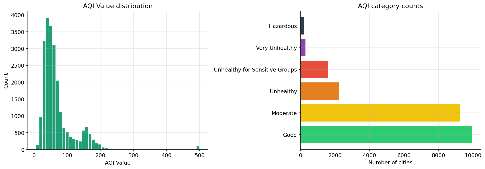

Feature correlation shows `pollutant_spread` and `pm2.5_aqi_value` are almost perfectly correlated with overall AQI, while CO, ozone, and NO2 contribute more modestly.

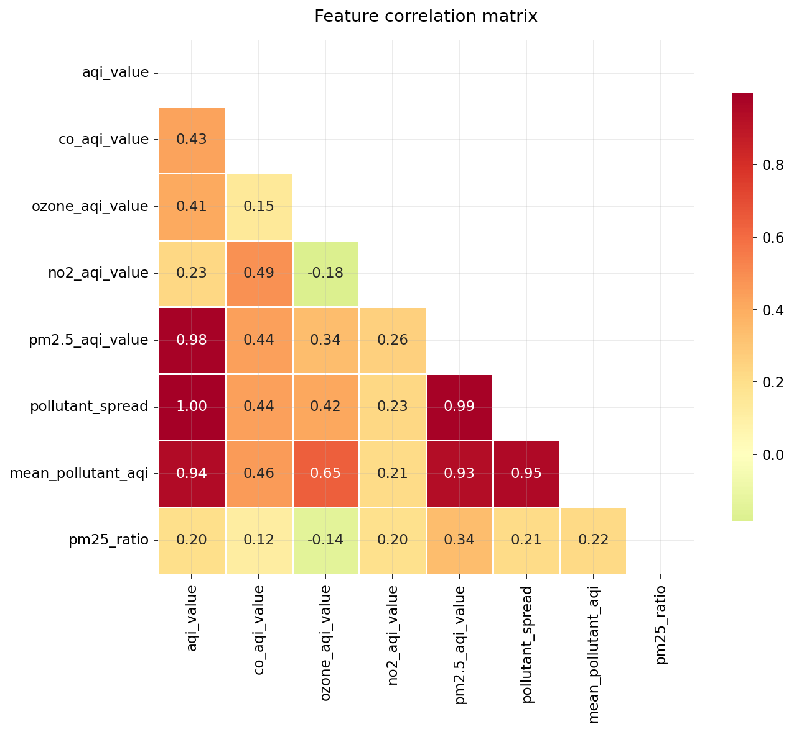

Country-level rankings highlight the most and least polluted countries by average AQI.

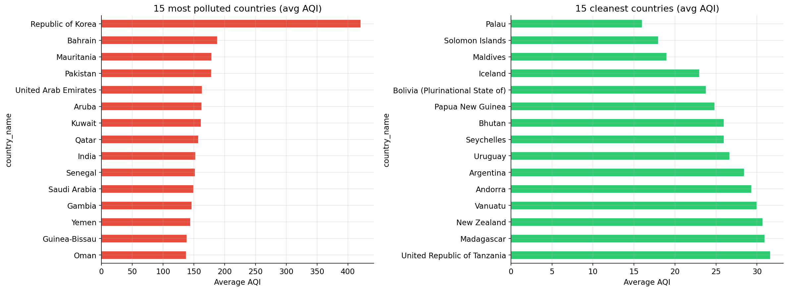

PM2.5 is consistently the dominant driver of AQI category severity across all six AQI bands.

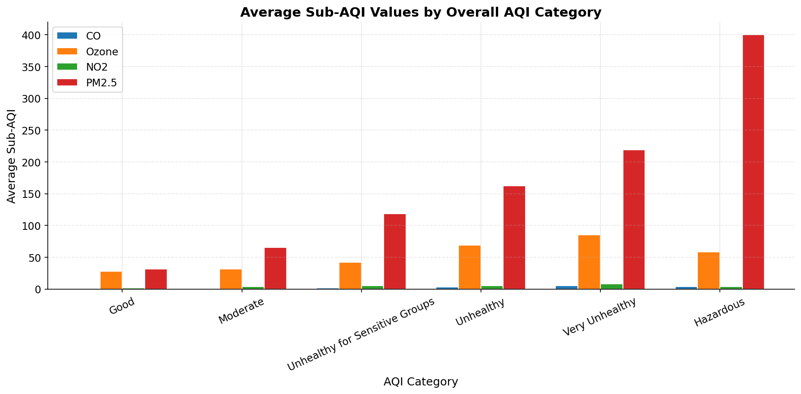

An interactive world map of AQI by city/country is available at `outputs/eda_05_world_aqi_map.html` (open it in a browser to explore).

### 2. Feature Engineering
`pollutant_spread`, `mean_pollutant_aqi`, `pm25_ratio`, and country encoding were derived to capture how concentrated or spread out pollution is across pollutant types.

### 3. Modeling
A Random Forest Regressor was trained to predict AQI, achieving near-perfect fit on held-out test data.

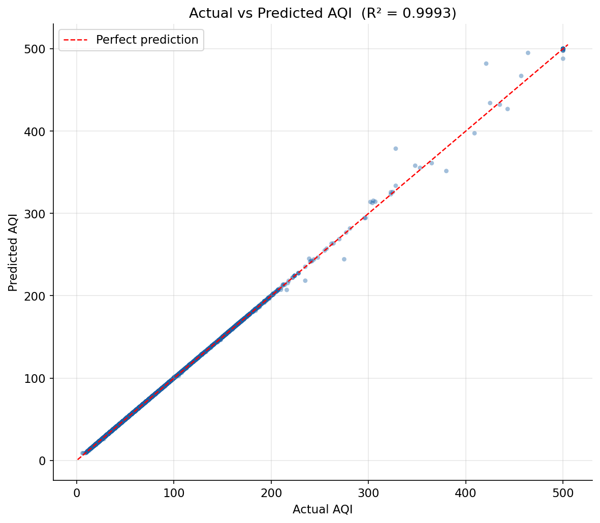

### 4. Model Diagnostics
Residuals are tightly centered at zero, with only a handful of high-AQI outliers showing larger errors.

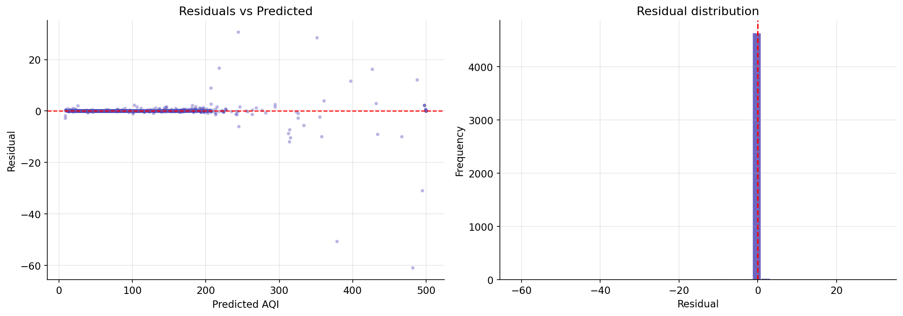

Feature importance confirms `pollutant_spread` as by far the strongest predictor.

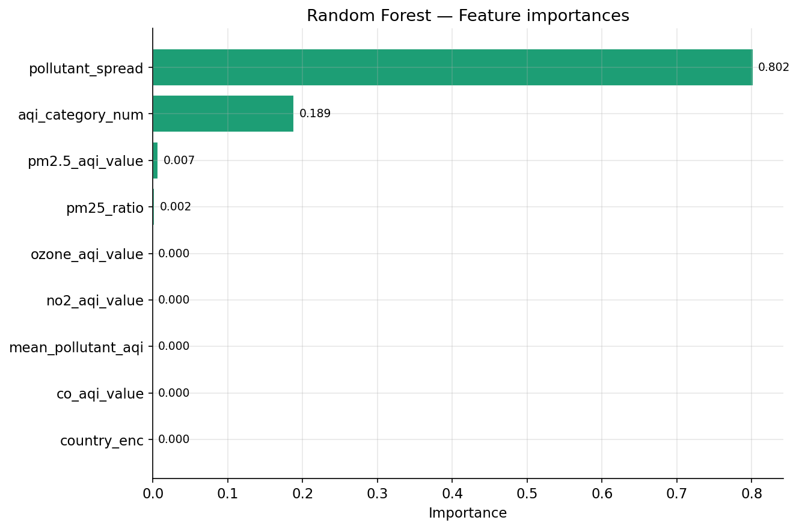

### 5. Explainability (SHAP)
SHAP values confirm and quantify the Random Forest's reliance on `pollutant_spread`, with `aqi_category_num` as a secondary contributor.

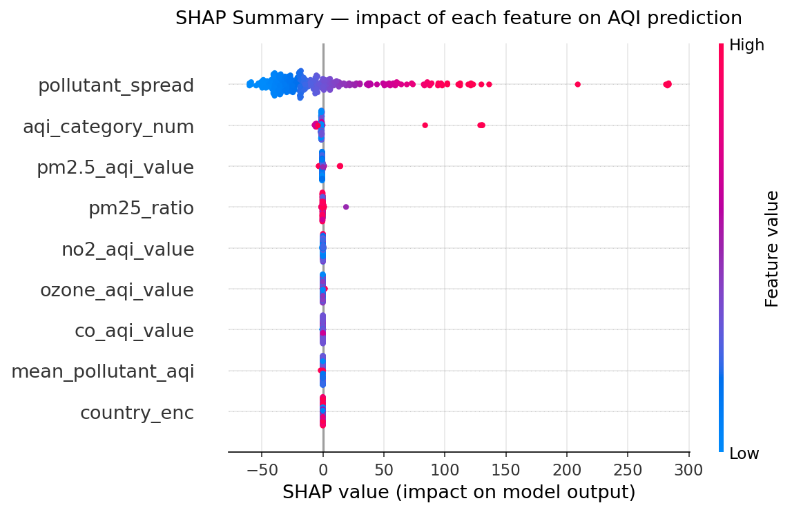
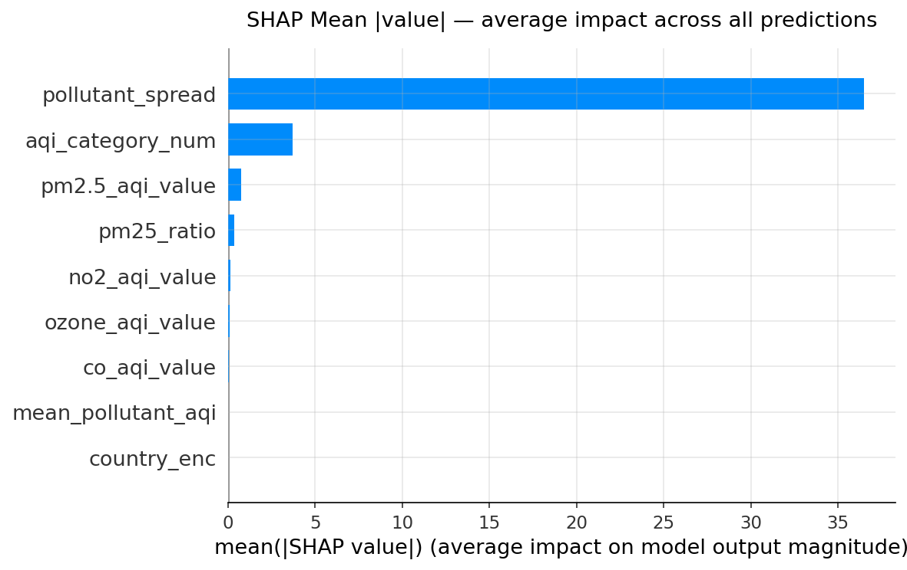

The PM2.5 dependence plot shows how SHAP contribution scales with PM2.5 concentration.

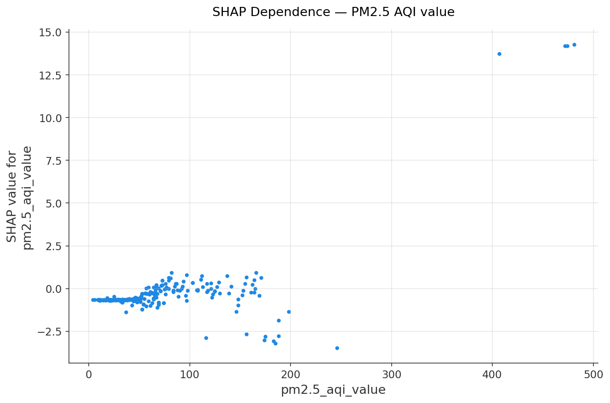

A waterfall plot breaks down exactly how each feature pushed the prediction for the single worst-predicted city.

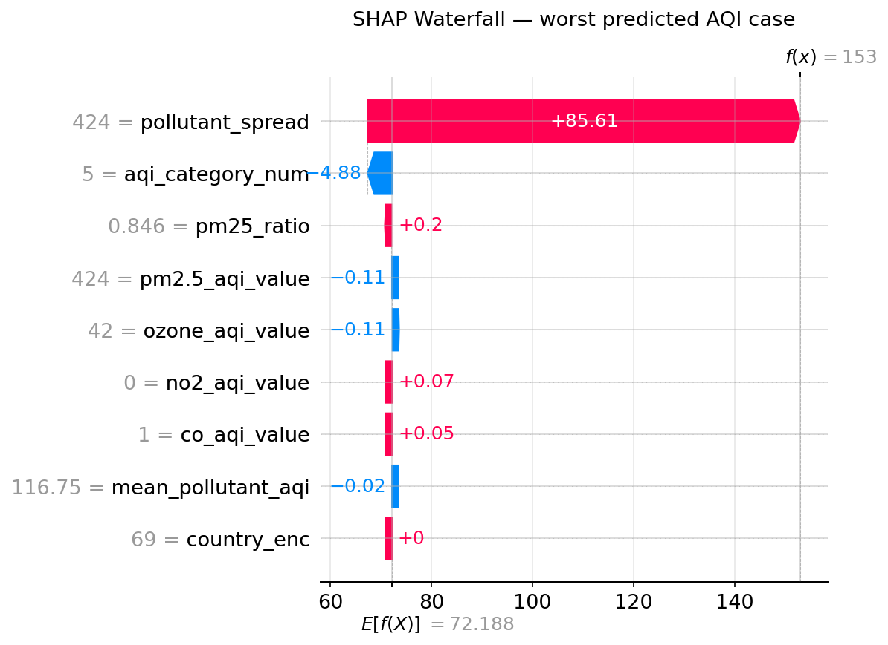

### 6. Policy Simulation
Simulating a 25% reduction in each pollutant shows PM2.5 cuts deliver by far the largest AQI improvement — over 10x the effect of an equivalent ozone reduction.

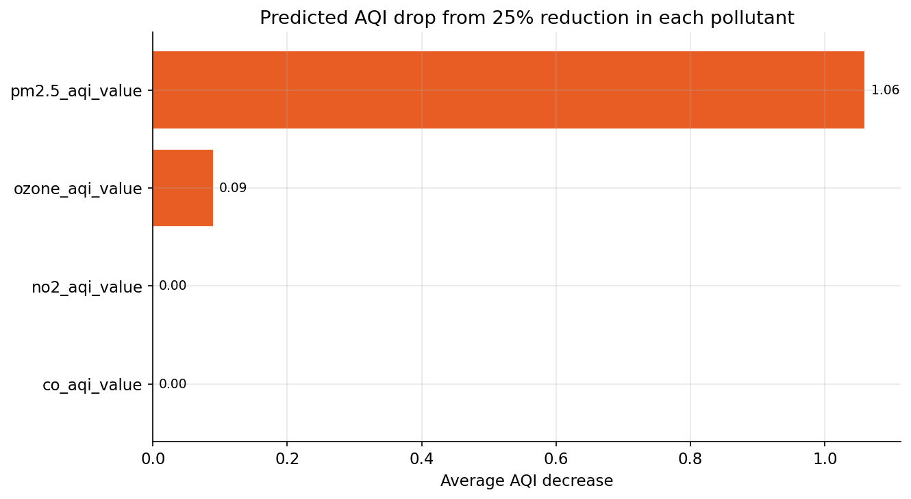

### 7. City Health Risk Report
Per-city risk scores are exported to `data/city_health_risk_report.csv` for downstream use (e.g., dashboards, public health prioritization).

## 🛠️ Tech Stack

- **Data processing:** pandas, numpy
- **Visualization:** matplotlib, seaborn, plotly
- **Modeling:** scikit-learn (Random Forest)
- **Explainability:** SHAP

## 🚀 Getting Started

```bash
git clone https://github.com/chihab-gheraibia/air-quality-health-impact.git
cd air-quality-health-impact
pip install -r requirements.txt
jupyter notebook notebooks/AIR_QUALITY_&_HEALTH_IMPACT.ipynb
```

## 📄 License

This project is open-sourced for educational and portfolio purposes.
